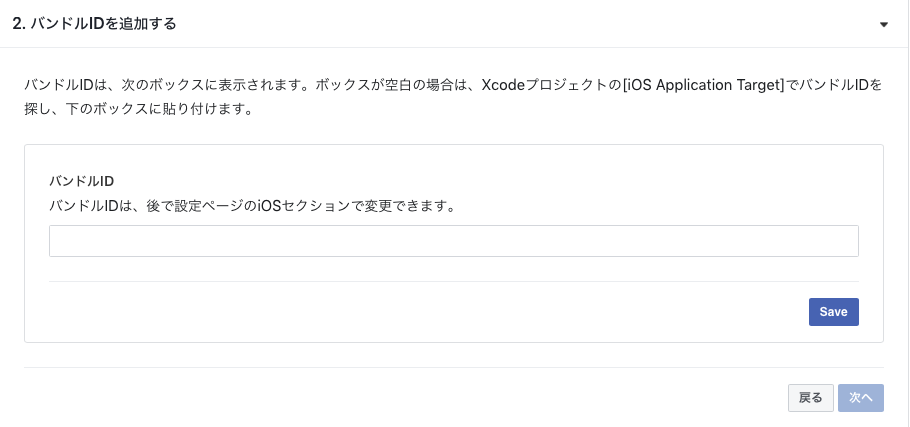

# 【iOS Objective-C】アプリにFacebookログイン機能をつけよう！


## 概要
* [ニフクラ mobile backend](https://mbaas.nifcloud.com/)の『SNS連携（Facebook連携）』を利用して、Facebookのログイン機能を実装したサンプルプロジェクトです
* Facebook連携で取得した会員データは[ニフクラ mobile backend](https://mbaas.nifcloud.com/)の『会員管理機能』として扱うことができます
 * [【iOS Objective-C】アプリにログイン機能をつけよう！](https://github.com/NIFCLOUD-mbaas/ObjcLoginApp)も用意していますので、ぜひ活用してください☆
* このコンテンツは簡単な操作ですぐに [ニフクラ mobile backend](https://mbaas.nifcloud.com/)の機能を体験いただけます★☆

## ニフクラ mobile backendって何？？
スマートフォンアプリのバックエンド機能（プッシュ通知・データストア・会員管理・ファイルストア・SNS連携・位置情報検索・スクリプト）が**開発不要**、しかも基本**無料**(注1)で使えるクラウドサービス！

注1：詳しくは[こちら](https://mbaas.nifcloud.com/price.htm)をご覧ください


## 動作環境
* Mac OS X 10.15.4 (Catalina)
* Xcode ver. 11.4.1
* iPhone8 ver. 13.4.1
* iOS SDK v3.1.0

※上記内容で動作確認をしています。
※古いバージョンだと動作しないい可能性があります。
※Simulatorでは動作しない可能性があります。実機ビルドが必要な場合は[こちら](http://qiita.com/natsumo/items/3f1dd0e7f5471bd4b7d9)をご覧ください。

## 手順
### 1. [ニフクラ mobile backend](https://mbaas.nifcloud.com/)の会員登録とログイン→アプリ作成

* 上記リンクから会員登録（無料）をします。登録ができたらログインをすると下図のように「アプリの新規作成」画面が出るのでアプリを作成します


* アプリ作成されると下図のような画面になります
* この２種類のAPIキー（アプリケーションキーとクライアントキー）はXcodeで作成するiOSアプリに[ニフクラ mobile backend](https://mbaas.nifcloud.com/)を紐付けるために使用します


* 動作確認後に会員情報（アクセストークン）が保存される場所も確認しておきましょう


### 2. [GitHub](https://github.com/NIFCLOUD-mbaas/ObjcFacebookLoginApp.git)からサンプルプロジェクトのダウンロード

* この画面([GitHub](https://github.com/NIFCLOUD-mbaas/ObjcFacebookLoginApp.git))のボタンをクリックし、さらにボタンをクリックしてサンプルプロジェクトをMacにダウンロードします

### 3. Xcodeでアプリを起動

* Using below command to install NCMB SDK and Facebook SDK.
```
pod install
```

* ダウンロードしたフォルダを開き、をダブルクリックしてXcode開きます　


### 4. APIキーの設定

* `AppDelegate.m`を編集します
* 先程[ニフクラ mobile backend](https://mbaas.nifcloud.com/)のダッシュボード上で確認したAPIキーを貼り付けます


* それぞれ`YOUR_APPLICATION_KEY`と`YOUR_CLIENT_KEY`の部分を書き換えます
 * このとき、ダブルクォーテーション（`"`）を消さないように注意してください！
* 書き換え終わったら`command + s`キーで保存をします

### 5. FacebookSDKを使用するための準備と設定

* [facebook for developers](https://developers.facebook.com/)にログイン（Facebookアカウントがない場合はアカウントを作成して）して、右上の「マイアプリ」からの「新しいアプリを追加」を選択します


* iOSを選択し、アプリ名（任意）を入力し、「新しいFacebookアプリIDを作成」をクリックします
* 「連絡先メールアドレス」と「カテゴリ」を入力して「アプリIDを作成」をクリックしてFacebookアプリを作成します
* 「Quick Start for iOS」の画面が出ます
* 二番の「バンドルIDを追加する」を「Bundle Identifier」を入力します。XcodeプロジェクトのBundle IDをコピペしてください
* 「Save」ボタンをクリックします

 

* ダッシュボードに戻ります。


* 「アプリ名」と「アプリID」をXcodeプロジェクトの`Info.plist`にコピペします


* またこの「アプリID」は[ニフクラ mobile backend](https://mbaas.nifcloud.com/)にも設定します
* 「アプリ設定」＞「SNS連携」を開いてFacebook連携の「Facebook連携の許可」にある「許可する」を選択し、「保存する」をクリックします


* 最後に上の「開発中」を「ライブモード」に変更します。「ライブモードに切り替えますか？」を「モード切り替え」にしておきます


### 6. 動作確認

* Xcode画面で左上の実行ボタン（さんかくの再生マーク）をクリックします

* シミュレーターが起動したら、Login画面が表示されます
* __Login__ ボタンをクリックします


* Facebookログインのブラウザが画面が表示されるのでしたがってログインを行います
* ログインに失敗した場合は画面にエラー内容が表示されます（Facebookログインのブラウザ画面でキャンセルした場合は表示されません）
 * 万が一エラーが発生した場合は、[こちら](https://mbaas.nifcloud.com/doc/current/rest/common/error.html)よりエラー内容を確認いただけます
* ログインに成功したらログアウトします


-----

* 保存に成功したら、[ニフクラ mobile backend](https://mbaas.nifcloud.com/)のダッシュボードから「会員管理」を確認してみましょう！
* `authData`にはアクセストークンが保存されます


操作はここまでです

## 解説
サンプルプロジェクトに実装済みの内容のご紹介

#### SDKのインポートと初期設定
* ニフクラ mobile backend の[ドキュメント（クイックスタート）](https://mbaas.nifcloud.com/doc/current/introduction/quickstart_ios.html)をご活用ください
* このDEMOアプリは「CocoaPods」を利用する方法でSDKをインポートしています

#### ロジック
* FacebookSDKを使用するための処理を`Appdelegate.m`に記述しています

```Objc
#import "AppDelegate.h"
#import "NCMB/NCMB.h"
#import <FBSDKCoreKit/FBSDKCoreKit.h>
#import <FBSDKLoginKit/FBSDKLoginKit.h>

@interface AppDelegate ()

@end

@implementation AppDelegate


- (BOOL)application:(UIApplication *)application didFinishLaunchingWithOptions:(NSDictionary *)launchOptions {
    // Override point for customization after application launch.
    //********** APIキーの設定とSDKの初期化 **********
    [NCMB setApplicationKey:@"YOUR_APPLICATION_KEY" clientKey:@"YOUR_CLIENT_KEY"];

    return [[FBSDKApplicationDelegate sharedInstance] application:application didFinishLaunchingWithOptions:launchOptions];
}

- (void)applicationWillEnterForeground:(UIApplication *)application {
    [FBSDKAppEvents activateApp];

}

- (BOOL)application:(UIApplication *)application openURL:(NSURL *)url sourceApplication:(NSString *)sourceApplication annotation:(id)annotation {
    return [[FBSDKApplicationDelegate sharedInstance] application:application openURL:url sourceApplication:sourceApplication annotation:annotation];

}

@end
```

* `Main.storyboard`でデザインを作成し、`LoginViewController.m`と`LogoutViewController.m`にロジックを書いています
 * Facebook連携はブラウザのFacebookページに遷移し、行われます。Facebookログインボタン押下時の処理は以下のように記述されます

```Objc
//
//  LoginViewController.m
//  ObjcFacebookLoginApp
//
// Loginボタン押下時の処理
- (IBAction)FacebookLoginBtn:(UIButton *)sender {
    // labelを空にする
    self.label.text = @"";
    if ([FBSDKAccessToken currentAccessToken]) {
        [self performSegueWithIdentifier:@"login" sender:self];
    } else {
        FBSDKLoginManager *loginManager = [[FBSDKLoginManager alloc] init];
        [loginManager logInWithPermissions:@[@"public_profile", @"email"] fromViewController:self handler:^(FBSDKLoginManagerLoginResult * _Nullable result, NSError * _Nullable error) {
           //TODO: process error or result
           if(error){
               // その他のエラーが発生した場合
               NSLog(@"エラーが発生しました:%ld", error.code);
               self.label.text = [NSString stringWithFormat:@"エラーが発生しました:%ld", error.code];
           } else {
               if(result.token.userID != nil){
                   // mobile backend会員登録するための認証情報を作成
                   NSDictionary *facebookInfo = @{@"id":result.token.userID,
                                                  @"access_token":result.token.tokenString,
                                                  @"expiration_date":result.token.expirationDate};

                   //会員のインスタンスを作成
                   NCMBUser *user = [NCMBUser user];

                   //Facebookの認証情報を利用して会員登録を行う
                   [user signUpWithFacebookToken:facebookInfo withBlock:^(NSError *error) {
                       if (error){
                           //会員登録に失敗した場合の処理
                           NSLog(@"Facebookの会員登録とログインに成功しました：%@", user.objectId);
                       } else {
                           //会員登録に成功した場合の処理
                           NSLog(@"Facebookの会員登録とログインに成功しました：%@", user.objectId);
                           [self performSegueWithIdentifier:@"login" sender:self];
                       }
                   }];
               } else {
                   if (result.isCancelled) {
                       // Facebookのログインがキャンセルされた場合
                       NSLog(@"Facebookのログインがキャンセルされました");
                       self.label.text = @"Facebookのログインがキャンセルされました";
                   } else {
                       // その他のエラーが発生した場合
                       NSLog(@"エラーが発生しました:%ld", error.code);
                       self.label.text = [NSString stringWithFormat:@"エラーが発生しました:%ld", error.code];
                   }

               }

           }

       }];
    }   
}
```

```Objc
//
//  LogoutViewController.m
//  ObjcFacebookLoginApp
//

// Logoutボタン押下時の処理
- (IBAction)logoutBtn:(UIButton *)sender {
    NSLog(@"ログアウトしました");
    FBSDKLoginManager *loginManager = [[FBSDKLoginManager alloc] init];
    // 非同期でログアウト
    [NCMBUser logOutInBackgroundWithBlock:^(NSError *error) {
        if (error){
            //エラー処理
            NSLog(@"Logout error %@", error);
        } else {
            // Facebookの認証情報を削除
            [loginManager logOut];
            [self dismissViewControllerAnimated:YES completion:nil];
        }
    }];
    
}
```

## 参考
### FacebookSDKを使ってFacebook会員認証するのとニフクラ mobile backendSDKを使ってFacebook会員認証するのは何が違うのか？


* もちろん直接FacebookSDKを呼ぶことも可能ですが、ニフクラ mobile backendSDKを呼べば裏でFacebookSDKを呼んで処理するNCMBUserメソッドが備わっているので、１つ呼べば、Facebookへのログインとニフクラ mobile backendへ会員情報保存が同時に行えるので一石二鳥というわけです
* また一度会員登録してしまえば、あとはニフクラ mobile backendの会員管理機能で処理が行えるので自前で会員管理システムを構築する必要がなくより楽に開発を行えます

### もっと深く知りたい方へ
* 同じ内容の【Swift】版もご用意しています
 * https://github.com/NIFCLOUD-mbaas/SwiftFacebookLoginApp
* ニフクラ mobile backend の[ドキュメント（SNS連携：Facebook連携）](https://mbaas.nifcloud.com/doc/current/sns/facebook_ios.html)をSwift版に書き換えたドキュメントをご用意していますので、ご活用ください
 * [SwiftでFacebook連携しよう！](http://qiita.com/natsumo/items/74453049d58d67363c29)
 * [【続】SwiftでFacebook連携しよう！（＜CocoaPods＞でuse_frameworks!を有効にした場合）](http://qiita.com/natsumo/items/74453049d58d67363c29)
